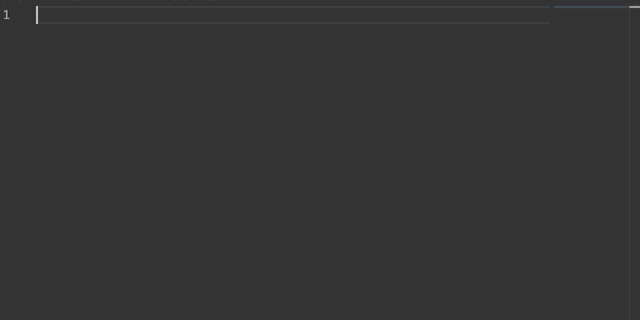

# aws-cdk-construct-snippet README

## Features

In an empty file type `construct` and it will generate an empty cdk constructor.

## Requirements

There are no hard requirements for this extension. However, it assumes you have `@aws-cdk/core` library installed in your package.

## Release Notes

### 0.0.1

Initial release of `construct` snippet

### 0.0.2

Update readme with gif